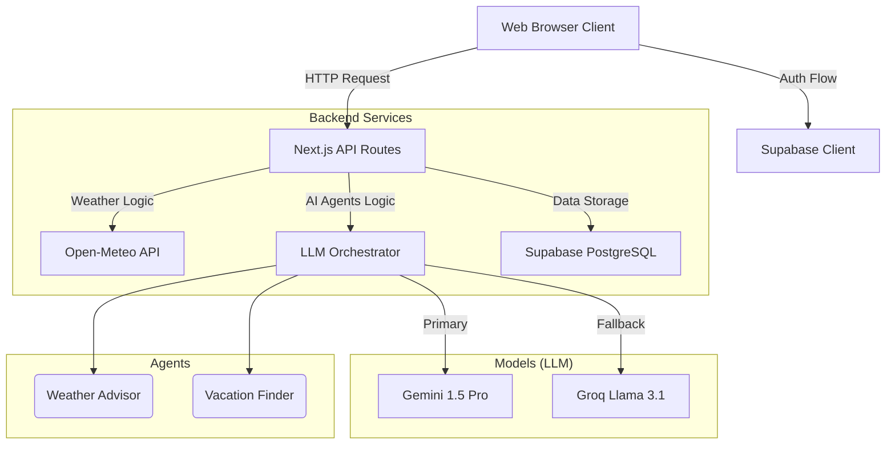
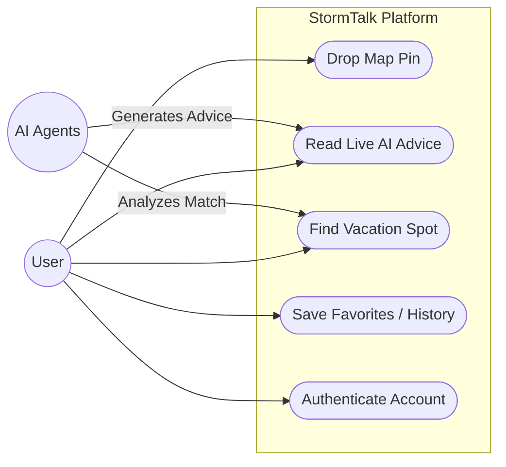

# StormTalk Architecture & Diagrams

## Core Components

### Frontend (Next.js)
- Home Page
- Interactive Map Page
- Vacation Finder Page
- Favorites
- History
- Auth (Login / Register)
- User Profile Preferences

### Backend API Routes
- `GET /api/weather` (Open-Meteo Integration)
- `GET /api/geocode` (Search Integration)
- `POST /api/debate` (Weather Advisor Agent)
- `POST /api/vacation` (Vacation Finder Agent)
- `GET/POST /api/favorites` (Supabase CRUD)
- `GET/POST /api/history` (Supabase CRUD)

### External Integrations
- **Open-Meteo API:** Raw weather parameters, completely free and reliable point data.
- **Gemini API:** Primary engine for complex cognitive routing, advice formulation, and prompt logic.
- **Groq Cloud (Llama 3.1):** High-speed LLM fallback layer.
- **Supabase:** PostgreSQL backend, User Auth, Profiles, History, and RLS.

## Multi-Agent AI System

### 1. Weather Advisor
- **Type:** Contextual Analyst
- **Role:** Generates clear, concise, and helpful advice (clothing, safety) based on real-time data inputs from the Leaflet coordinates.

### 2. Vacation Finder
- **Type:** Intelligent Locator
- **Role:** Extracts subjective desired conditions from user input, matches them to physical locations globally, and queries live weather data before returning actionable destination options.

## UML Diagrams

### 1. Unified Component & Flow Diagram (Architecture)

### 2. User Use Case Diagram

## Data Persistence (Relations)

### `profiles`
- user_id (FK -> Auth)
- preferred_unit

### `favorites`
- id
- user_id
- latitude, longitude
- label
- created_at

### `history`
- id
- user_id
- latitude, longitude
- ai_conversation (JSON store)
- created_at
