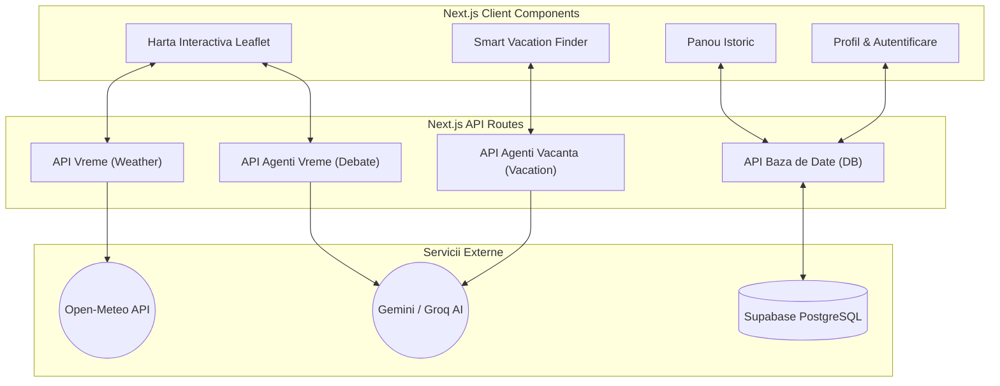
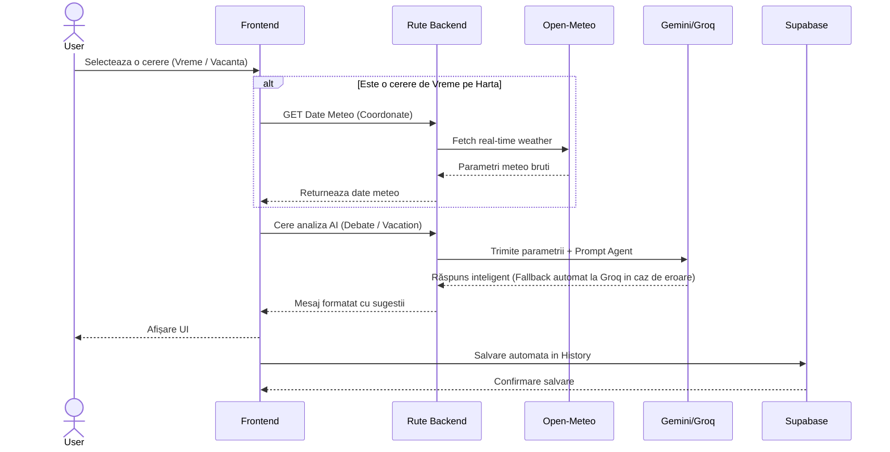
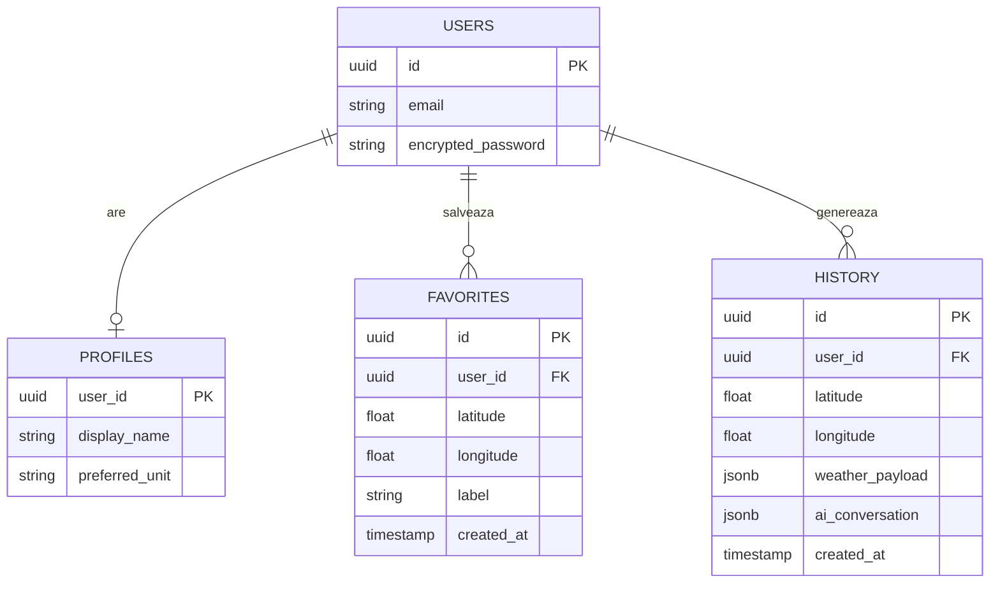

# Arhitectura StormTalk

Acest document prezintă vizual arhitectura sistemului StormTalk, modul de comunicare între componente, fluxul datelor AI și structura bazei de date. Diagramele sunt redate folosind Mermaid (randate automat pe GitHub).

## 1. Arhitectura de Componente (UML Component Diagram)

Această diagramă ilustrează împărțirea logică a aplicației între interfața de utilizator (Frontend), rutele server-side (Backend) și API-urile externe.

## 2. Fluxul de Execuție AI (Sequence Diagram)

Diagrama de mai jos prezintă fluxul pas-cu-pas care se întâmplă atunci când un utilizator selectează o locație pentru analiza vremii sau pentru planificarea vacanței:

## 3. Schema Bazei de Date (Entity-Relationship Diagram)

Baza de date relațională este găzduită pe Supabase și gestionează utilizatorii, setările acestora, istoricul conversațiilor AI și destinațiile favorite.

