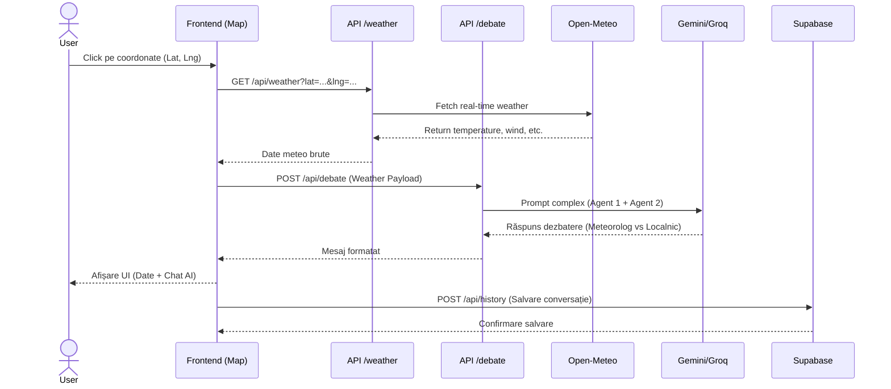
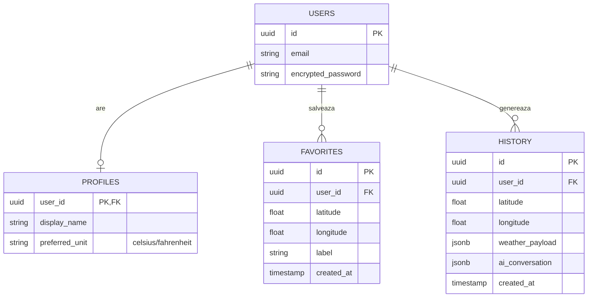

# Arhitectura StormTalk

Acest document prezintă vizual arhitectura sistemului StormTalk, modul de comunicare între componente, fluxul datelor AI și structura bazei de date. Diagramele sunt redate folosind Mermaid (randate automat pe GitHub).

## 1. Arhitectura de Componente (UML Component Diagram)

Această diagramă ilustrează împărțirea logică a aplicației între interfața de utilizator (Frontend), rutele server-side (Backend) și API-urile externe.

```mermaid
graph TD
    %% Frontend Components
    subgraph Frontend [Next.js Client Components]
        Map[Harta Interactiva Leaflet]
        Vacation[Smart Vacation Finder]
        Profile[Profil & Autentificare]
        History[Panou Istoric]
    end

    %% Backend API Routes
    subgraph Backend [Next.js API Routes]
        API_Weather[/api/weather/]
        API_Debate[/api/debate/]
        API_Vacation[/api/vacation/]
        API_DB[/api/history & /api/favorites]
    end

    %% External Services
    subgraph External [Servicii Externe]
        OpenMeteo((Open-Meteo API))
        Gemini((Gemini / Groq AI))
        Supabase[(Supabase PostgreSQL)]
    end

    %% Connections
    Map <--> API_Weather
    Map <--> API_Debate
    Vacation <--> API_Vacation
    History <--> API_DB
    Profile <--> API_DB

    API_Weather --> OpenMeteo
    API_Debate --> Gemini
    API_Vacation --> Gemini
    API_DB <--> Supabase
```

## 2. Fluxul de Execuție AI (Sequence Diagram)

Diagrama de mai jos prezintă fluxul pas-cu-pas care se întâmplă atunci când un utilizator selectează un punct pe hartă: de la obținerea coordonatelor, extragerea datelor meteo, până la dezbaterea generată de agenții AI.



## 3. Schema Bazei de Date (Entity-Relationship Diagram)

Baza de date relațională este găzduită pe Supabase și gestionează utilizatorii, setările acestora, istoricul conversațiilor AI și destinațiile favorite.


